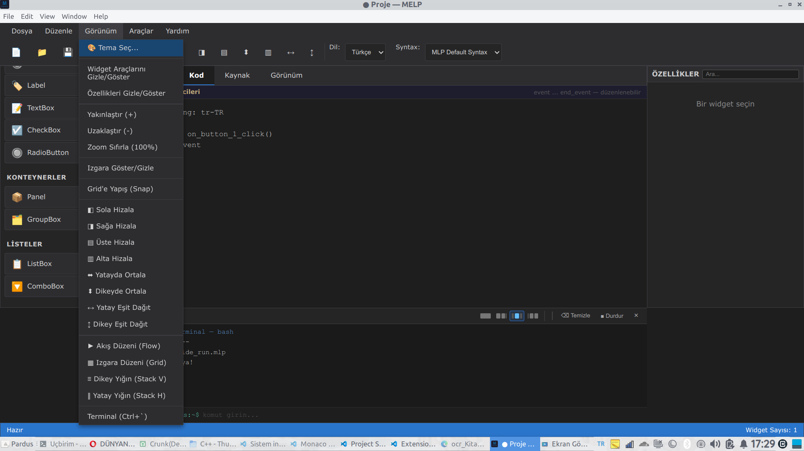

# MLP GUI Designer

**Visual Studio tarzında profesyonel GUI tasarım aracı - MLP Dili için**


MLP GUI Designer ile **masaüstü GUI programlama** yapabilirsiniz! MLP programlama dili için grafiksel kullanıcı arayüzü (GUI) uygulamaları tasarlamanıza olanak tanıyan, Visual Studio tarzında profesyonel bir görsel editördür.



## 🌟 Özellikler

### ✨ Visual Studio Benzeri Arayüz
- **Sürükle-Bırak Widget Sistemi**: Widget'ları toolbox'tan çalışma alanına sürükleyin
- **Canlı Özellik Paneli**: Seçili widget'ın özelliklerini anında düzenleyin
- **Tasarım/Kod Görünümü**: Tasarım ve kod görünümü arasında kolayca geçiş yapın
- **Profesyonel Dark Theme**: Göz yormayan, modern arayüz

### 🎨 Widget Desteği
- **Temel Bileşenler**: Button, Label, TextBox, CheckBox, RadioButton
- **Konteynerler**: Panel, GroupBox
- **Listeler**: ListBox, ComboBox
- Tüm widget'lar tamamen özelleştirilebilir

### ⚙️ Gelişmiş Özellikler
- **Görsel Düzenleme**: Fareyle widget'ları taşıyın, yeniden boyutlandırın
- **Özellik Editörü**: Renk, boyut, metin, event handler'lar ve daha fazlası
- **Otomatik Kod Üretimi**: Tasarımınızdan otomatik MLP kodu oluşturur
- **Proje Yönetimi**: Projeleri kaydedin ve tekrar yükleyin (.mlpgui formatı)
- **Şablon Sistemi**: Widget gruplarını `.mlptemplate` dosyası olarak kaydedin ve paylaşın
- **MLP Kod Dışa Aktarımı**: Çalıştırılabilir MLP kodu olarak dışa aktarın

### ⌨️ Klavye Kısayolları
- `Ctrl+N`: Yeni proje
- `Ctrl+O`: Proje aç
- `Ctrl+S`: Projeyi kaydet
- `Ctrl+E`: MLP kodunu dışa aktar
- `F5`: Kodu göster/çalıştır
- `Delete`: Seçili widget'ı sil

## 📦 Kurulum ve Başlatma

### Gereksinimler

- Node.js 16+ ve npm (bilgisayarınızda yüklü olmalı)
- Electron 28+ (npm install ile otomatik yüklenecek)

### Kurulum Adımları

1. **Projeye gidin:**

```bash
cd mlp_gui_designer
```

2. **Bağımlılıkları yükleyin:**

```bash
npm install
```

Bu komut Electron ve diğer gerekli paketleri otomatik olarak indirecektir (yaklaşık 310 paket).

3. **Uygulamayı başlatın:**

```bash
npm start
```

Uygulama penceresi otomatik olarak açılacaktır! 🎉

### Diğer Komutlar

**Geliştirme modu (DevTools açık):**

```bash
npm run dev
```

**Testleri çalıştırın:**

```bash
npm test
```

**Standalone binary oluşturun:**

```bash
npm run build
```

Build işlemi sonrası `dist/` klasöründe çalıştırılabilir dosyaları bulabilirsiniz.

## 🎯 Kullanım Kılavuzu

### 1. Yeni Proje Oluşturma
- **Dosya > Yeni Proje** veya `Ctrl+N`
- Çalışma alanı temizlenir ve yeni bir proje başlatılır

### 2. Widget Ekleme
- Sol paneldeki **Widget Araçları** bölümünden istediğiniz widget'ı seçin
- Widget'ı çalışma alanına sürükleyin ve bırakın
- Widget otomatik olarak eklenir ve seçilir

### 3. Widget Düzenleme
- **Taşıma**: Widget'a tıklayın ve sürükleyin
- **Yeniden Boyutlandırma**: Seçili widget'ın köşelerindeki mavi noktaları sürükleyin
- **Özellikler**: Sağ panelde widget özelliklerini düzenleyin
- **Silme**: Widget'ı seçin ve `Delete` tuşuna basın

### 4. Özellik Düzenleme
Sağ panelde aşağıdaki özellik gruplarını bulabilirsiniz:
- **Pozisyon ve Boyut**: X, Y, Genişlik, Yükseklik
- **Görünüm**: Metin, renkler, font boyutu
- **Davranış**: Etkin, görünür, işaretli
- **Olaylar**: onClick, onChange, onSelect event handler'ları

### 5. Event Handler Tanımlama
1. Widget'ı seçin
2. Sağ panelde **Olaylar** bölümünü bulun
3. Event handler fonksiyon adını girin (örn: `butona_tikla`)
4. Kod görünümüne geçin - fonksiyon şablonu otomatik oluşturulur
5. Fonksiyonu istediğiniz gibi düzenleyin

### 6. Kod Görünümü
- **Tasarım/Kod** sekmelerini kullanarak görünümler arasında geçiş yapın
- Kod görünümünde tasarımınızın MLP kodunu görürsünüz
- Kod otomatik olarak oluşturulur ve her değişiklikte güncellenir

### 7. Proje Kaydetme
- **Dosya > Kaydet** veya `Ctrl+S`
- `.mlpgui` uzantılı proje dosyası olarak kaydedilir
- Proje dosyası tüm widget'ları ve özelliklerini içerir

### 8. MLP Kodu Dışa Aktarma
- **Dosya > MLP Kodu Dışa Aktar** veya `Ctrl+E`
- `.mlp` uzantılı çalıştırılabilir kaynak kod dosyası oluşturulur
- Bu dosyayı MLP derleyicisi ile derleyebilirsiniz

## 📋 Örnek Kullanım

### Basit "Merhaba Dünya" Uygulaması

1. **Label ekleyin:**
   - `Label` widget'ını canvas'a sürükleyin
   - Metin özelliğini "Merhaba Dünya!" olarak ayarlayın
   - Pozisyon: X=100, Y=50

2. **Button ekleyin:**
   - `Button` widget'ını ekleyin
   - Metin: "Tıkla"
   - Pozisyon: X=100, Y=100
   - onClick: `butona_tikla`

3. **Kodu dışa aktarın:**
   - `Ctrl+E` tuşlarına basın
   - `merhaba.mlp` olarak kaydedin

4. **Derleyin ve çalıştırın:**
```bash
mlpc merhaba.mlp
./merhaba
```

## 🏗️ Proje Yapısı

```
melp-ide/
├── main.js                 # Electron ana süreç
├── preload.js             # Preload script (güvenlik köprüsü)
├── index.html             # Ana HTML
├── package.json           # NPM yapılandırması
├── assets/
│   ├── icon.png           # Uygulama ikonu (512×512)
│   ├── icon.svg           # İkon kaynak dosyası
│   └── styles/
│       └── main.css       # Ana stil dosyası
├── tests/
│   ├── run-tests.js       # Test runner
│   └── test-helpers.js    # helpers.js birim testleri
├── docs/dev/              # Geliştirici notları
└── src/
    ├── app.js             # Ana uygulama mantığı
    ├── components/
    │   ├── widget.js      # Widget sınıfı
    │   ├── properties.js  # Özellik paneli
    │   ├── designer.js    # Ana designer sınıfı
    │   └── code-generator.js  # MLP kod üreteci
    └── utils/
        ├── helpers.js     # Yardımcı fonksiyonlar
        ├── intellisense.js # IntelliSense motoru
        └── syntax-validator.js # Sözdizimi doğrulayıcı
```

## 🔧 Teknik Detaylar

### Widget Sistemi
Her widget şu özelliklere sahiptir:
- Benzersiz ID
- Tip (button, label, vb.)
- Özellikler (pozisyon, boyut, görünüm, davranış)
- Event handler'lar
- DOM elementi

### Kod Üretimi
Designer otomatik olarak şu MLP kodunu üretir:
- Widget ID tanımlamaları
- Event handler fonksiyon şablonları
- GUI başlatma kodu
- Widget oluşturma çağrıları
- Ana event loop
- Cleanup kodu

### Dosya Formatları
- **`.mlpgui`**: MLP GUI Designer proje dosyası (JSON formatında)
- **`.mlptemplate`**: Widget grubu şablon dosyası (paylaşılabilir)
- **`.mlp`**: MLP kaynak kod dosyası

## 🤝 Katkıda Bulunma

Katkılarınızı bekliyoruz! Lütfen:
1. Fork yapın
2. Feature branch oluşturun (`git checkout -b feature/amazing-feature`)
3. Commit edin (`git commit -m 'feat: Add amazing feature'`)
4. Push edin (`git push origin feature/amazing-feature`)
5. Pull Request açın

## 📝 Lisans

MIT License - Detaylar için [LICENSE](../LICENSE) dosyasına bakın.

## 🎓 MLP Dili Hakkında

MLP GUI Designer, [MLP (Multi-Language Programming)](../README.md) dili için tasarlanmıştır. MLP, çok dilli syntax desteği ve self-hosting özelliğine sahip modern bir programlama dilidir.

## 🆘 Destek

Sorularınız veya önerileriniz için:
- Issue açın: [GitHub Issues](https://github.com/your-repo/issues)
- Dokümantasyon: [MLP Docs](../docs/)

## 🎉 Teşekkürler

MLP GUI Designer'ı kullandığınız için teşekkür ederiz! Güzel uygulamalar geliştirmenizi dileriz.

---

**Not:** MLP GUI Designer'ın ürettiği kodu çalıştırabilmek için MLP runtime'ında GUI fonksiyonlarının implementasyonu gereklidir. Detaylar için `runtime/gui_sdl.c` veya `runtime/gui_mock.c` dosyalarına bakın.
